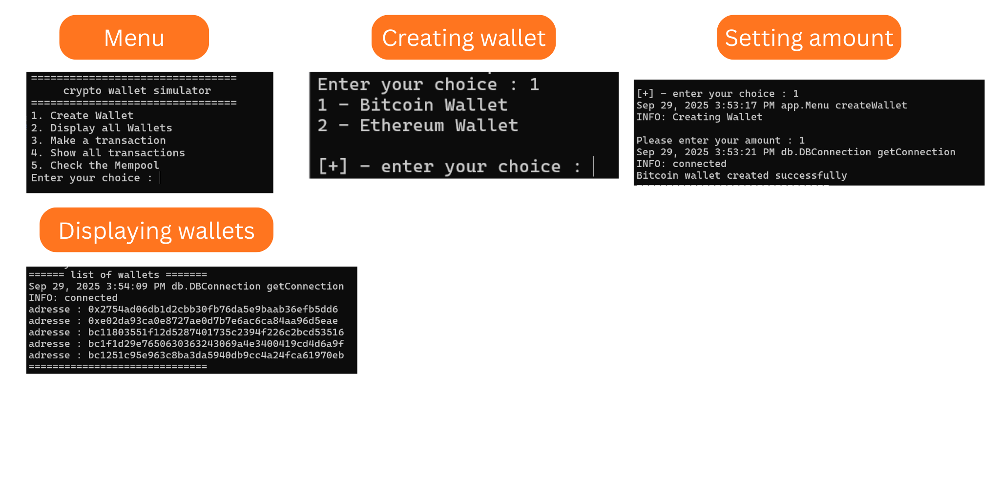
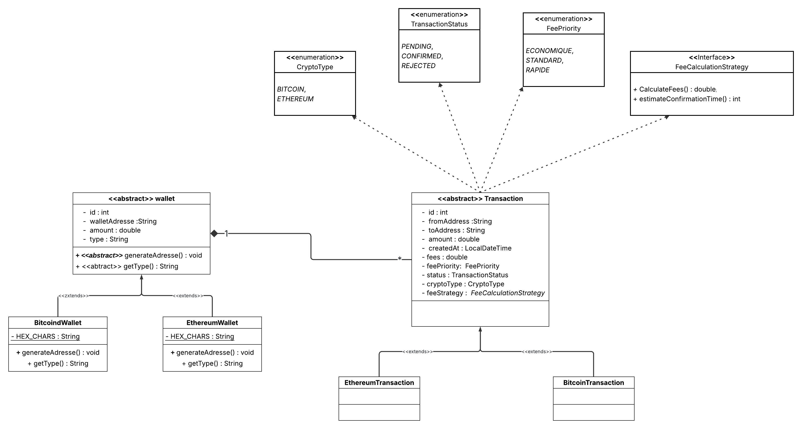

# 🔐 Crypto Wallet Simulator

A comprehensive Java-based cryptocurrency wallet simulator that supports Bitcoin and Ethereum transactions with realistic fee calculations, transaction validation, and balance management.

## 🎯 Project Showcase


## 📋 Table of Contents

- [Features](#-features)
- [Technologies Used](#-technologies-used)
- [Architecture](#-architecture)
- [Project Structure](#-project-structure)
- [Class Diagram](#-class-diagram)
- [Installation & Setup](#-installation--setup)
- [Running the Application](#-running-the-application)
- [Testing](#-testing)


## ✨ Features

- **Multi-Currency Support**: Bitcoin and Ethereum wallet management
- **Transaction Processing**: Complete transaction lifecycle with validation
- **Fee Calculation**: Dynamic fee calculation based on priority levels
- **Balance Management**: Real-time balance updates and validation
- **Transaction History**: Complete transaction tracking and history
- **Mempool Simulation**: Transaction queuing and processing simulation
- **Input Validation**: Comprehensive input validation and error handling
- **Database Integration**: PostgreSQL database for persistent storage
- **Comprehensive Testing**: Unit tests for all major components

## 🛠 Technologies Used

### Core Technologies
- **Java 8+** - Primary programming language
- **JUnit 4** - Unit testing framework
- **PostgreSQL** - Database management system
- **JDBC** - Database connectivity

### Design Patterns
- **Strategy Pattern** - Fee calculation strategies
- **Repository Pattern** - Data access layer abstraction
- **Singleton Pattern** - Database connection management
- **Service Layer Pattern** - Business logic separation

### Development Tools
- **Eclipse IDE** - Development environment
- **Maven/Gradle** - Build management (if applicable)
- **Git** - Version control

## 🏗 Architecture

The application follows a **layered architecture** with clear separation of concerns:

```
┌─────────────────────────────────────────┐
│            Presentation Layer           │
│  (Menu, User Interface, Input/Output)   │
└─────────────────┬───────────────────────┘
                  │
┌─────────────────▼───────────────────────┐
│             Service Layer               │
│  (Business Logic, Transaction Processing│
│   Validation, Balance Management)       │
└─────────────────┬───────────────────────┘
                  │
┌─────────────────▼───────────────────────┐
│            Repository Layer             │
│     (Data Access, CRUD Operations)      │
└─────────────────┬───────────────────────┘
                  │
┌─────────────────▼───────────────────────┐
│            Database Layer               │
│         (PostgreSQL Database)           │
└─────────────────────────────────────────┘
```

### Key Architectural Components

1. **Presentation Layer**: Handles user interaction and menu navigation
2. **Service Layer**: Contains business logic for transactions, validation, and balance management
3. **Repository Layer**: Abstracts data access operations
4. **Model Layer**: Defines entities and data structures
5. **Strategy Layer**: Implements different fee calculation strategies
6. **Database Layer**: PostgreSQL database for data persistence

## 📁 Project Structure

```
crypto-wallet-simulator/
├── src/
│   ├── app/                    # Application entry point and menu
│   │   ├── MainApp.java       # Main application class
│   │   └── Menu.java          # User interface and navigation
│   ├── db/                    # Database connectivity
│   │   └── DBConnection.java  # Singleton database connection
│   ├── enums/                 # Enumeration definitions
│   │   ├── CryptoType.java    # Supported cryptocurrencies
│   │   ├── FeePriority.java   # Transaction fee priorities
│   │   └── TransactionStatus.java # Transaction states
│   ├── model/                 # Data models
│   │   ├── Wallet.java        # Abstract wallet class
│   │   ├── BitcoinWallet.java # Bitcoin wallet implementation
│   │   ├── EthereumWallet.java # Ethereum wallet implementation
│   │   ├── Transaction.java   # Abstract transaction class
│   │   ├── BitcoinTransaction.java # Bitcoin transaction
│   │   ├── EthereumTransaction.java # Ethereum transaction
│   │   └── User.java          # User model
│   ├── repository/            # Data access layer
│   │   ├── Repository.java    # Generic repository interface
│   │   ├── JdbcRepository.java # Base JDBC repository
│   │   ├── WalletRepository.java # Wallet data operations
│   │   └── TransactionRepository.java # Transaction data operations
│   ├── service/               # Business logic layer
│   │   ├── WalletService.java # Wallet management service
│   │   ├── TransactionService.java # Transaction operations
│   │   ├── TransactionValidationService.java # Transaction validation
│   │   ├── TransactionProcessingService.java # Transaction processing
│   │   ├── BalanceService.java # Balance management
│   │   └── MempoolService.java # Transaction queuing
│   ├── strategy/              # Strategy pattern implementations
│   │   ├── FeeCalculationStrategy.java # Fee calculation interface
│   │   ├── BitcoinFeeStrategy.java # Bitcoin fee calculation
│   │   └── EthereumFeeStrategy.java # Ethereum fee calculation
│   ├── test/                  # Unit tests
│   │   ├── TransactionServiceTest.java
│   │   ├── WalletServiceTest.java
│   │   ├── TransactionValidationServiceTest.java
│   │   ├── TransactionProcessingServiceTest.java
│   │   └── FeeStrategyTest.java
│   ├── util/                  # Utility classes
│   │   ├── Identifiable.java  # ID interface
│   │   └── InputValidation.java # Input validation utilities
│   └── validation/            # Validation logic
│       └── AdresseValidator.java # Address validation
├── app.jar                    # Executable JAR file
├── postgresql-42.7.8.jar     # PostgreSQL JDBC driver
└── README.md                 # This file
```


## 🎯 Class Diagram




### Key Classes and Relationships

- **MainApp** → **Menu** → **Services**
- **Services** → **Repositories** → **Database**
- **Strategy Pattern**: **FeeCalculationStrategy** ← **BitcoinFeeStrategy**, **EthereumFeeStrategy**
- **Model Hierarchy**: **Wallet** ← **BitcoinWallet**, **EthereumWallet**
- **Transaction Hierarchy**: **Transaction** ← **BitcoinTransaction**, **EthereumTransaction**


## 🚀 Installation & Setup

### Prerequisites

- **Java 8 or higher** installed on your system
- **PostgreSQL 12+** database server
- **Git** for cloning the repository

### Database Setup 

1. **Install PostgreSQL** on your system
2. **Create a database** named `crypto`:
   ```sql
   CREATE DATABASE crypto;
   ```

3. **Create the required tables**:
   ```sql
   -- Wallets table
   CREATE TABLE wallets (
       id SERIAL PRIMARY KEY,
       wallet_address VARCHAR(255) UNIQUE NOT NULL,
       amount DECIMAL(20,8) NOT NULL DEFAULT 0,
       type VARCHAR(50) NOT NULL
   );

   -- Transactions table
   CREATE TABLE transactions (
       id SERIAL PRIMARY KEY,
       from_address VARCHAR(255) NOT NULL,
       to_address VARCHAR(255) NOT NULL,
       amount DECIMAL(20,8) NOT NULL,
       fees DECIMAL(20,8) NOT NULL,
       fee_priority VARCHAR(20) NOT NULL,
       status VARCHAR(20) NOT NULL DEFAULT 'PENDING',
       crypto_type VARCHAR(20) NOT NULL,
       created_at TIMESTAMP DEFAULT CURRENT_TIMESTAMP
   );
   ```

4. **Update database credentials** in `src/db/DBConnection.java`:
   ```java
   private final String URL = "jdbc:postgresql://localhost:5432/crypto";
   private final String USERNAME = "your_username";
   private final String PASSWORD = "your_password";
   ```

### Clone the Repository

```bash
git clone https://github.com/ChehAchraf/crypto-wallet-simulator-java.git
cd crypto-wallet-simulator
```

## ▶️ Running the Application

### Option 1: Run with Compiled Classes

1. **Compile the project**:
   ```bash
   # Navigate to the src directory
   cd src
   
   # Compile all Java files
   javac -cp ".;../postgresql-42.7.8.jar" -d ../bin app/*.java db/*.java enums/*.java model/*.java repository/*.java service/*.java strategy/*.java util/*.java validation/*.java
   ```

2. **Run the application**:
   ```bash
   # From the project root directory
   java -cp "bin;postgresql-42.7.8.jar" app.MainApp
   ```

### Option 2: Run with JAR File

1. **Use the provided JAR file**:
   ```bash
   java -cp "app.jar;postgresql-42.7.8.jar" app.MainApp
   ```

### Expected Output

```
Starting Main App
Connected to database successfully
Driver was loaded successfully
connected

=== Crypto Wallet Simulator ===
1. Create Wallet
2. View Wallet Balance
3. Send Transaction
4. View Transaction History
5. View Mempool
6. Exit

Please select an option:
```

## 🧪 Testing

The project includes comprehensive unit tests for all major components.

### Running Tests

1. **Compile test files**:
   ```bash
   cd src
   javac -cp ".;../postgresql-42.7.8.jar;../junit-4.13.2.jar;../hamcrest-core-1.3.jar" -d ../bin test/*.java
   ```

2. **Run specific test class**:
   ```bash
   java -cp "bin;postgresql-42.7.8.jar;junit-4.13.2.jar;hamcrest-core-1.3.jar" org.junit.runner.JUnitCore test.TransactionServiceTest
   ```

3. **Run all tests**:
   ```bash
   java -cp "bin;postgresql-42.7.8.jar;junit-4.13.2.jar;hamcrest-core-1.3.jar" org.junit.runner.JUnitCore test.TransactionServiceTest test.WalletServiceTest test.TransactionValidationServiceTest test.TransactionProcessingServiceTest test.FeeStrategyTest
   ```

### Test Coverage

- **TransactionServiceTest**: 15 test methods covering transaction operations
- **WalletServiceTest**: 12 test methods covering wallet management
- **TransactionValidationServiceTest**: 10 test methods covering validation logic
- **TransactionProcessingServiceTest**: 8 test methods covering transaction processing
- **FeeStrategyTest**: 12 test methods covering fee calculation strategies

### Fee Calculation Strategies

#### Bitcoin Fee Strategy
- **Economique**: 80% of base fee, 240 minutes confirmation
- **Standard**: 100% of base fee, 120 minutes confirmation
- **Rapide**: 100% of base fee, 30 minutes confirmation

#### Ethereum Fee Strategy
- **Fixed fee calculation** based on gas limit and gas price
- **Variable confirmation times** based on priority

## 👥 Authors

- **Achraf Chehboun** - *Software Developer* - [https://github.com/ChehAchraf](https://github.com/yourusername)


---

**Note**: This is a simulator for educational purposes. Do not use for real cryptocurrency transactions.
